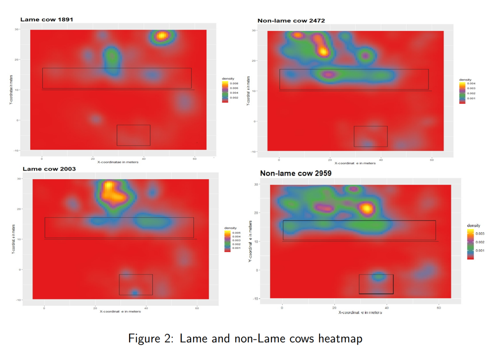
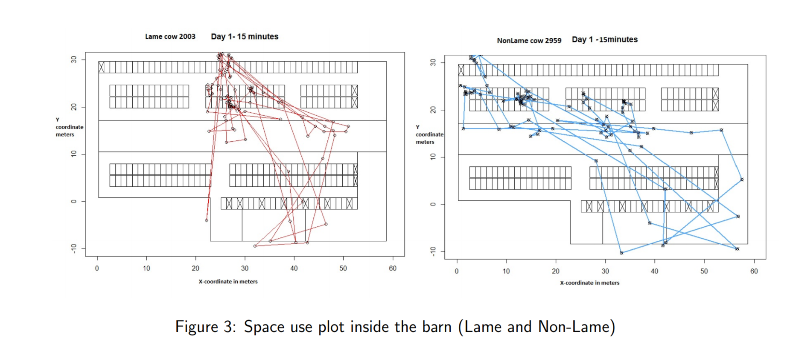

## CNN-on-Heatmap-AnimalHealth-Prediction

Illness in cattle has been identified as one of the major concerns commercial farms are
facing. Early identification of lameness not only saves economical costs in milk production
for farmers but also helps the animal to get treated early and saves from severe pain. Using
automated methods with the aid of sensor technology can be used to continuously monitor the
behaviour of cows within a barn which gets rid of traditional time-consuming lameness detection methods.This research study focuses on the prediction of lameness in cows by analyzing
the behaviour of cows within the barn. Also, it presents various techniques and approaches
that has been done in the past and what techniques could be done in future in finding the lameness in cows.Significant patterns differentiating lame and non lame cows have been presented
in this paper. The evaluation metrics that will be used and some of the feature engineering
techniques that would be promising in helping the algorithms in detecting the lameness.This
paper also discusses two sample approaches to predict lameness based on behaviours of cows
within the barn.One is logistic regression which has been done by a previous study but with
less variables in the sample 5 day dataset. Also, a simple Convolutional neural network to
classify lameness from the heatmaps generated over the 5 days is also implemented with limited images and the paper also discusses the limitations of the approaches and and the future
work to carry out in 5 months dataset.

 ## Materials and Methods
 
 The data has been smoothed by aggregating all the features on 2minute average to reduce the
sensor error. The heat map for lame and non lame have plotted which can be shown in the below
figure. Randomly lame and non lame cows have been selected. Feeding area and milking area has
been plotted using the x,y coordinates for a perticular day to distinguish the area between feeding
and resting in cubicles barn. The intensity shows the time spent on that particular area. More
intensity generally means that the cow has spent more time.

The rectangle in the middle area of the plot represents the feeding area and the small square at
the bottom of the barn area represents the milking parlour in the barn. Clearly some patterns could
be observed between lame and non lame cows. A wide spread inside the barn area is observed in
non lame cows whereas intensity is higher at particular points for lame cows. Also, non lame cows
spend significant amount of time in feeding area and less densities could be observed for lame cows
in feeding area.

 ## Future Work
 
In this study,a sample demonstration is shown on how location tracking data obtained from animalmounted wireless sensors can be processed and analyzed using a Real Time Location System to
provide a set of behavioral measures for space-use using 5 days data which could be transferred
to 5 months data as well. Also,different models were used in a cross-sectional research design to
discover changes in barn-use behavior between the lame and non lame barn-housed cows and found
notable changes between lame and non-lame cows. Significant findings like lame cattle spent less
time throughout the feeding area and more time in the barn’s cubicle areas endorses with previous
researches. The data size used in this study for 10 non lame and 10 lame cows was trivial which was
aggregated over each day and aggregated over each cows, so care should be taken to extrapolate
our findings and conclusions directly to other researches and proposals. Also, various methods ,steps
and approaches were discussed shortly to experiment with the 5 months dataset. However,a more
generalized results and related methods could possibly be created in upcoming dissertation study
to create a new range of models for computerized tracking of barn cows, identifying and predicting
health status in cattle by using the 5 months data.
